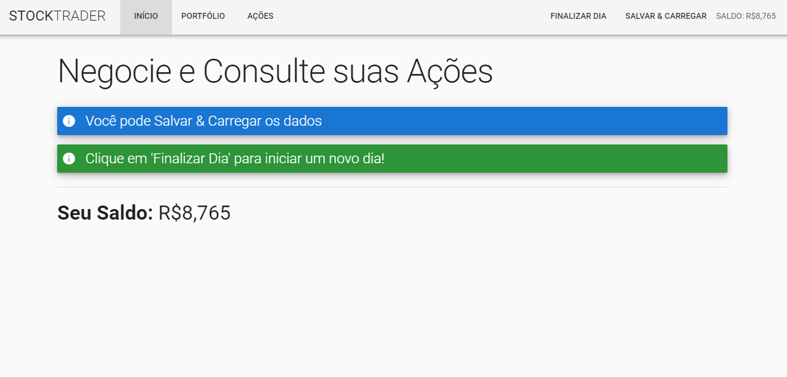

# stock-trader

Projeto sobre compra e venda de ações feito em VueJS(Vuetify, Axios, VueRouter, Vuex) + Firebase como forma de atividade de um curso de VueJS.

 

## Project setup
```
npm install
```

### Compiles and hot-reloads for development
```
npm run serve
```

### Compiles and minifies for production
```
npm run build
```

### Run your tests
```
npm run test
```

### Lints and fixes files
```
npm run lint
```

### Customize configuration
See [Configuration Reference](https://cli.vuejs.org/config/).
